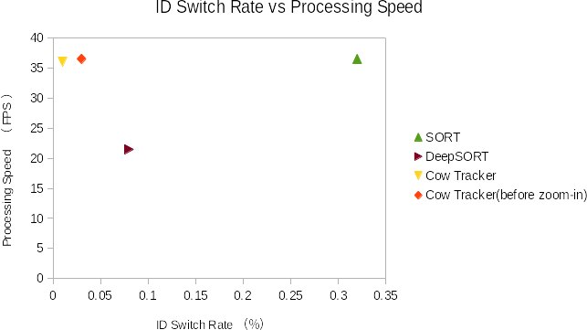

# cow_tracker

[](https://colab.research.google.com/drive/11YcqqZ1lj9ALbwDRnGnOpnCdBZ3MLx9L?usp=sharing)


Cow tracking implemented with YOLOv4, DeepSORT, and TensorFlow. This work is modified version of [yolov4-deepsort](https://github.com/theAIGuysCode/yolov4-deepsort) by [The AI Guy](https://github.com/theAIGuysCode), to be applicable for tracking herd of cows, suitable with their behaviour. This code is only applicable on a fixed camera recording. In consideration of high-speed processing, the appearance features used in DeepSORT are removed.

## My Graduation Thesis (in Japanese)
  * [Thesis](data/helpers/aminnin_sotsuron.pdf)
  * [Presentation](data/helpers/aminnin_presen.pdf)  

## Demo of Cow Tracker compared with SORT and DeepSORT
Video is screen recorded from [Cattle Pond Pasture](https://explore.org/livecams/farm-sanctuary/cattle-pond-pasture-farm-sanctuary)
and the research benchmark is based on ID switch rate and FPS.

### SORT #1
<p align="center"></p>

### DeepSORT #1
<p align="center"></p>

### Cow Tracker #1
<p align="center"></p>


### SORT #2
<p align="center"></p>

### DeepSORT #2
<p align="center"></p>

### Cow Tracker #2
<p align="center"></p>

## Result
<p align="center"></p>

## Getting Started
To get started, install the proper dependencies either via Anaconda or Pip. I recommend Anaconda route for people using a GPU as it configures CUDA toolkit version for you.

### Conda (Recommended)

```bash
# Tensorflow CPU
conda env create -f conda-cpu.yml
conda activate yolov4-cpu

# Tensorflow GPU
conda env create -f conda-gpu.yml
conda activate yolov4-gpu
```

### Pip
(TensorFlow 2 packages require a pip version >19.0.)
```bash
# TensorFlow CPU
pip install -r requirements.txt

# TensorFlow GPU
pip install -r requirements-gpu.txt
```
### Nvidia Driver (For GPU, if you are not using Conda Environment and haven't set up CUDA yet)
Make sure to use CUDA Toolkit version 10.1 as it is the proper version for the TensorFlow version used in this repository.
https://developer.nvidia.com/cuda-10.1-download-archive-update2

## Downloading Official YOLOv4 Pre-trained Weights
Our object tracker uses YOLOv4 to make the object detections, which deep sort then uses to track. There exists an official pre-trained YOLOv4 object detector model that is able to detect 80 classes. For easy demo purposes we will use the pre-trained weights for our tracker.
Download pre-trained yolov4.weights file: https://drive.google.com/open?id=1cewMfusmPjYWbrnuJRuKhPMwRe_b9PaT

Copy and paste yolov4.weights from your downloads folder into the 'data' folder of this repository.

## Running the Tracker with YOLOv4
To implement the object tracking using YOLOv4, first we convert the .weights into the corresponding TensorFlow model which will be saved to a checkpoints folder. Then all we need to do is run the object_tracker.py script to run our cow tracker with YOLOv4, Sort and TensorFlow.
```bash
# Convert darknet weights to tensorflow model
python save_model.py --model yolov4 

# Run yolov4 deep sort object tracker on video
python object_tracker.py --video ./data/video/cow.mp4 --output ./outputs/cow_tracker.mp4 --model yolov4 --count


```
The output flag allows you to save the resulting video of the object tracker running so that you can view it again later. Video will be saved to the path that you set. (outputs folder is where it will be if you run the above command!)


## Resulting Video (Demo)

<p align="center"></p>
<p align="center"></p>


### Reference and Credit

   Huge shoutout and credit goes to The AI Guy for creating the yolov4-tensorflow-deepsort for this repository's reference:
  * [yolov4-deepsort](https://github.com/theAIGuysCode/yolov4-deepsort)

### Contact

Please contact me at ahmadaminin@gmail.com if you had any question or problem.
